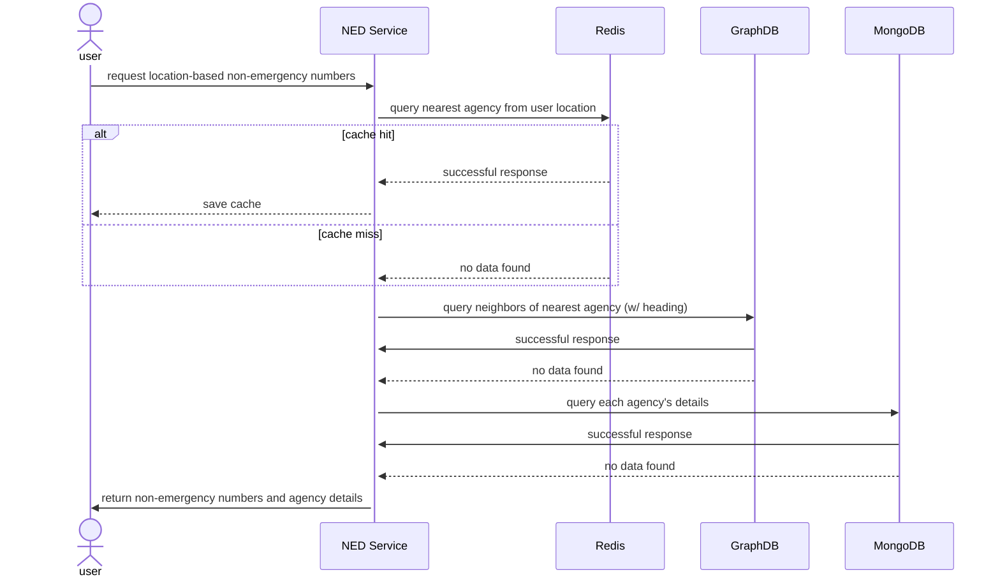

```mermaid
sequenceDiagram
  actor U as user
  participant N as NED Service
  participant R as Redis
  participant G as GraphDB
  participant M as MongoDB
  U->>N: request location-based non-emergency numbers
  activate N
  N->>R: query nearest agency from user location
  alt cache hit
    R-->>N: successful response
    N-->>U: save cache
  else cache miss
    R-->>N: no data found
  end
  N->>G: query neighbors of nearest agency (w/ heading)
  G->>N: successful response
  G-->>N: no data found
  N->>M: query each agency's details
  M->>N: successful response
  M-->>N: no data found
  N->>U: return non-emergency numbers and agency details
```