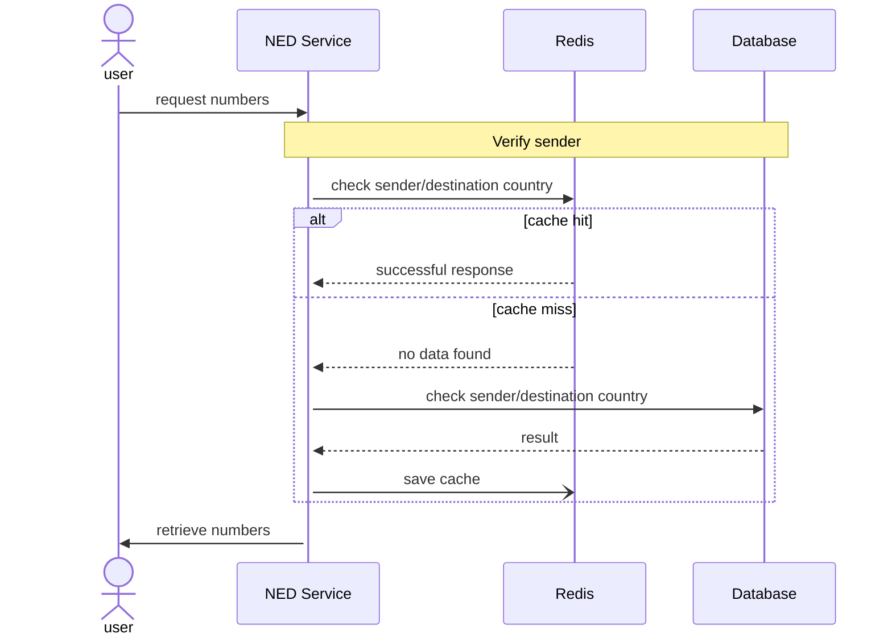

```mermaid
sequenceDiagram

  actor U as user
  participant N as NED Service
  participant R as Redis
  participant D as Database
  U->>N: request numbers
  activate N
  Note over N,D: Verify sender
  N->>R: check sender/destination country
  alt cache hit
    R-->>N: successful response
  else cache miss
    R-->>N: no data found
    N->>D: check sender/destination country
    D-->>N: result
    N-)R: save cache
  end
  N->>U: retrieve numbers
```